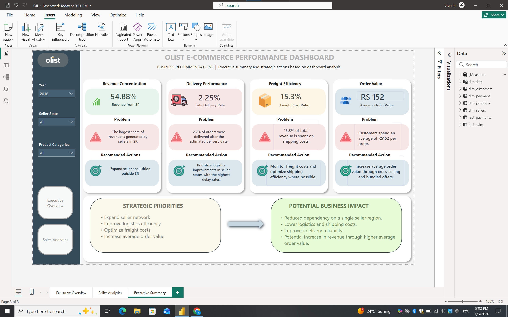
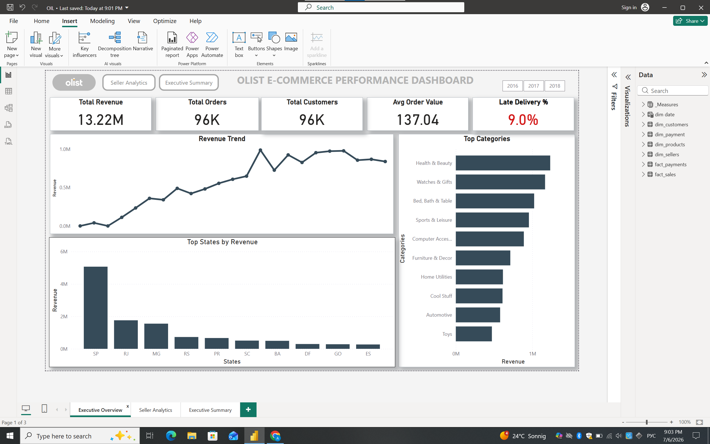
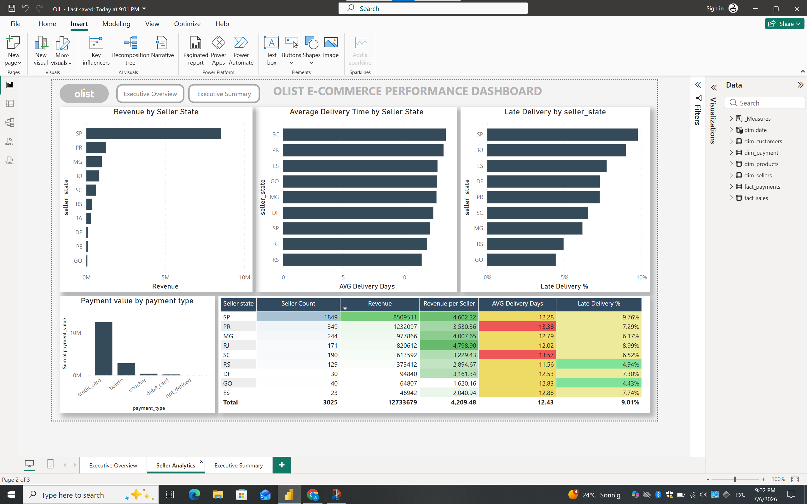

# Olist E-commerce Performance Dashboard

Power BI dashboard analyzing sales performance, seller activity, and logistics using the Olist Brazilian E-commerce dataset.


---

## Overview

This project analyzes sales, seller performance, delivery efficiency, and freight costs through an interactive Power BI dashboard.

The report consists of three pages:

- Executive Overview
- Seller Analytics
- Executive Summary

---

## Objectives

- Analyze sales performance
- Evaluate seller activity across Brazilian states
- Monitor delivery and logistics performance
- Identify business improvement opportunities

---

## Tools

- SQL
- Power BI
- Power Query
- DAX

---

## Workflow

1. Prepared reporting views in SQL.
2. Imported data into Power BI.
3. Built the data model.
4. Created DAX measures and KPIs.
5. Designed interactive dashboards.
6. Summarized findings and business recommendations.

---

## Dashboard

### Executive Overview

Business KPIs and sales trends.

### Seller Analytics

Seller performance, logistics, and regional analysis.

### Executive Summary

Business findings, recommended actions, and strategic priorities.

---

## Key Findings

- Revenue is concentrated among sellers located in São Paulo.
- Delivery performance varies across seller states.
- Freight costs account for approximately 16% of total revenue.
- Average Order Value suggests opportunities for increasing basket size.

---

## Repository Structure

```
olist-ecommerce-performance-dashboard/
│
├── screenshots
├── /Dashboard.pbix
├── README.md
└── SQL_views_POWERBI.sql
```

---

## Dashboard Preview

### Executive Overview



### Seller Analytics



### Executive Summary


